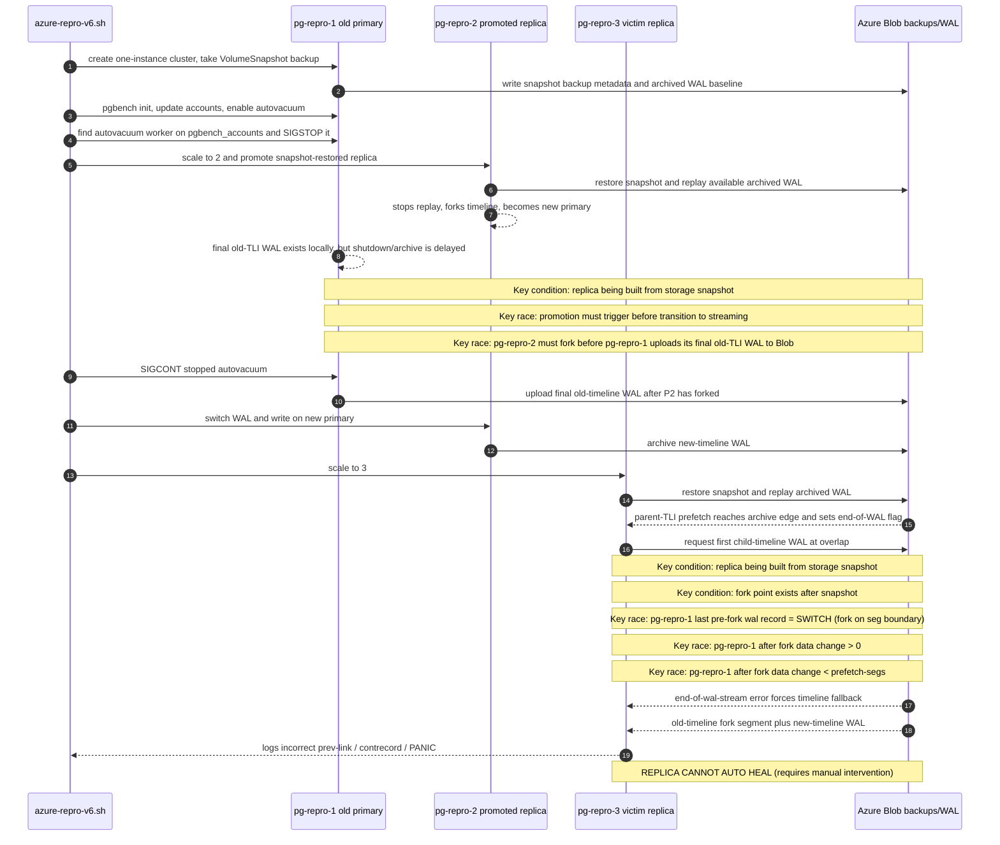

# CNPG WAL Restore v6 Repro

`azure-repro-v6.sh` reproduces a CNPG replica in a failed state which cannot be recovered automatically. The issue is a wrong-timeline WAL restore failure, induced by creating an old-timeline segment via a slow/hung shutdown, promoting a snapshot replica, then adding a third snapshot replica that restores the wrong parent-timeline WAL and gets into an unrecoverable `record with incorrect prev-link` error loop. The script defaults to the Barman Cloud plugin path and accepts `intree` as an explicit argument for the legacy `spec.backup.barmanObjectStore` path.

This is a simplified reproduction demonstrating the same issue that caused a real (and painful) production incident. The cause of the production incident was the shutdown hang reported on hackers at https://www.postgresql.org/message-id/flat/CA%2BfnDAa8Kbbx3KkqpfxutTx41RchJsT3Lykqwcedm0CVr5Tw%3DA%40mail.gmail.com

This repro exercises a bug in CNPG's `barman-cloud` package triggered by `restore_command` for snapshot-restored replicas. A parallel prefetch on the parent timeline reaches the end of archived WAL and writes a global `end-of-wal-stream` flag. The next `restore_command` call is for the child-timeline WAL at the fork boundary, but the flag is not scoped by timeline, so `wal-restore` returns `ErrEndOfWALStreamReached` before checking object storage for that child-timeline file.

After the initial WAL download is missed for the new timeline, Postgres replay falls back to the parent-timeline candidate, which is already present in the local spool from prefetch, and applies the wrong-timeline bytes. When replay continues into child-timeline WAL, the record chain no longer matches and Postgres fails with `record with incorrect prev-link` or `contrecord is requested by <LSN>`. The affected replica remains unable to advance replay and requires manual rewind or rebuild.

The purpose of this reproduction was to diagnose and fully understand the failure, test the fix, and improve general diagnostics and observability for future similar issues.

Repro is deterministic and consistent. Example output at [run-logs/](run-logs/)

## Repro Versions

- AKS/Kubernetes: `v1.36.1` *(latest)*
- PostgreSQL: `18.4` *(latest)*
- CloudNativePG: `1.29.2`
- Barman Cloud plugin: `0.13.0` when running the default plugin mode

While the `barman-cloud` bug is not fixed in CloudNativePG `1.30.0` this script will no longer reproduce. The new writer/primary lease changes promotion ordering: while the old primary still holds or renews the lease, the promotee logs `Primary lease not yet acquired, retrying` and does not complete promotion. That prevents the same-segment old/new timeline overlap that is required to trigger the `barman-cloud` bug in this repro.

The underlying bug can be triggered on existing replicas by storage-rebuild operations, for example when performing cloud storage upgrades which require creation of new PVCs - like azure premium ssd v1 to azure premium ssd v2.

## Reproduction Sequence

## Reproduction Preconditions

- Replica creation must use the VolumeSnapshot restore path. Without a completed VolumeSnapshot backup, CNPG adds replicas with live `pg_basebackup` from the primary, which streams current WAL and removes the replay lag needed for the bug.
- There must be WAL-generating workload after the snapshot. The current v6 script uses only a data volume, so the snapshot captures the data PVC state at that point; only later WAL creates archive replay work for snapshot-restored replicas.
- Parallel WAL prefetch must be enabled (`maxParallel: 32` in current v6). The old-timeline prefetch batch must run past the last archived old-TLI segment so it plants the `end-of-wal-stream` flag before PostgreSQL asks for the first child-timeline segment.
- The promoted replica must stop replaying and fork before the old primary's final old-timeline WAL reaches Azure Blob. This is the key race: at fork time, the divergent old-TLI segment must not yet be drainable by the promotee. In v6 this is forced by SIGSTOPing an autovacuum worker so shutdown waits in `PM_WAIT_BACKENDS` (mirroring a real production incident), but a slow checkpoint or a long WAL drain could also create delay.
- After the promoted replica has forked, the old primary must finish/demote and archive a complete old-timeline fork segment. CNPG fences the node during much of promotion but there are windows before and after where uploads can get through.
- The parent timeline's final pre-fork record must be `SWITCH`; otherwise the one-shot flag is consumed by probing for a child-timeline segment that does not exist. This generally requires the system to be idle enough not to fill a segment after the timeout-triggered archival before new-primary-promotion.
- The system can't be completely idle; there must be some real past-fork WAL records, for example a CHECKPOINT.
- There cannot be too many post-fork WAL records. If the old-TLI archive extends far enough that the victim's prefetch batch succeeds instead of running off the archive edge, the `end-of-wal-stream` flag is not set before the child-TLI request and the bug does not reproduce. The current script uses `PGBENCH_SCALE=28` and `maxParallel=32` to make this alignment less fragile.
- A final snapshot-restored replica must replay from the archive after both timeline copies exist. Its old-TLI prefetch must set the flag, the next child-TLI request must receive the `end-of-wal-stream` error, and PostgreSQL must fall back to the old-TLI spool copy.
- The new-timeline WAL after the skipped segment must be present, so replay crosses from wrong old-TLI content into real new-TLI content and hits `incorrect prev-link` or `contrecord is requested by <LSN>`.

## My Many Failed Attempts To Reproduce

This list covers the retained logs in `run-logs/`: original `azure-repro-*` trigger/setup/clean logs, v2/CNPG3, v3, v4, v5, and v6 variants, plus support logs for stream timing, forensics waits, autovacuum discovery, hang sessions, checkpoint/slow-shutdown experiments, plugin-mode controls, and CNPG 1.30 control runs. Several runs eventually reproduced, but the failed/non-repro history mattered because each miss isolated another necessary precondition.

- Some early runs were not meaningful because the harness itself was still unstable: logs were not retained, old-primary pod logs were lost, and a few runs ended before the diagnostic point needed to explain them.
- Cleanup originally did not fully reverse setup, including the CNPG operator, CRDs, Barman plugin `ObjectStore` resources, plugin/cert-manager support resources, and old WAL/archive blobs, so operator/CRD/version drift or stale archive contents could contaminate later attempts.
- Azure setup issues caused setup failures or false negatives: wrong credential mode, reused Backup names, missing barman catalog backups for bootstrap recovery, old CSI behavior rejecting `instantAccessDurationMinutes`, too-short snapshot waits, and Kubernetes API resources not being ready yet.
- AKS/CSI timing changed pod suffixes after `kubectl cnpg destroy`; scripts that assumed the next pod would be a fixed `pg-repro-N` could wait on the wrong pod.
- Destroy/recreate cycles could reuse existing PVCs instead of creating a fresh snapshot-restored instance. Those PVCs may already have had local `pg_wal` files, so the replacement instance could advance from local WAL instead of exercising the intended archive-restore path.
- Some early topology attempts watched a separate recovery/victim cluster, or a bootstrap-recovery flow, instead of the original-cluster promoted replica and later snapshot-restored replica. Those runs answered the wrong crash/no-crash question.
- Barman-only replica creation used `pg_basebackup` from the primary, which streamed current WAL and made forks land cleanly at the primary tip.
- Without a completed VolumeSnapshot backup, CNPG used the normal join path instead of the snapshot restore path, so the new replica did not enter the archive-replay geometry needed for the bug.
- Streaming catch-up during CNPG promotion latency repeatedly let the promotee reach the old primary tip before `pg_ctl promote` finished.
- `pg_wal_replay_pause()` paused apply but not WAL receipt, so the standby still received WAL to the tip and promotion applied it cleanly.
- SIGSTOPing the promotee walreceiver froze the LSN, but it wedged CNPG promotion; releasing it let the replica catch up cleanly.
- Healthy streaming switchover is a negative control: CNPG waits for walreceiver shutdown before promotion, and PostgreSQL/walsenders drain the old primary's shutdown WAL, so the promote target forks after end-of-stream instead of behind the old primary.
- The archive-lag plus recycled-off-disk gate targeted an impossible state because `archive_mode=on` pins unarchived WAL locally.
- Sync-replication and walreceiver-freeze experiments could hang, wedge promotion, or self-heal via streaming instead of producing the target archive state.
- A background `psql` heredoc bug meant an intended blocking/write workload did not actually run in at least one sync-block experiment.
- Attempts to SIGSTOP the checkpointer, archiver, walsender, or otherwise force a chosen fork point either wedged the primary, let a restarted archiver upload the WAL anyway, or let the promotee drain the WAL before forking.
- Checkpoint-pause and pre-promote archive-switch logs showed that pausing archiver/walsender/checkpointer could still leave no `CHECKPOINT_ONLINE`/`SWITCH` past the fork, or could put those records before the fork rather than in the divergent region.
- Dirty-cache and slow-shutdown experiments made shutdown slower, but did not by themselves create the necessary restore-side race between final old-TLI upload and child-TLI replay.
- Out-of-band in-pod `pg_ctl promote` could prove PostgreSQL can fork at a paused LSN, but CNPG ownership then reverted or rebuilt the instance unless the operator-driven promotion path also agreed.
- Some script comments described corrected behavior that was not actually wired into the cluster spec yet.
- Several runs mixed version assumptions across repro tracks, for example PG/CNPG combinations chosen for convenience versus incident-fidelity runs. Their negative results were not comparable to the active repro geometry.
- The shutdown path was misunderstood several times: `destroy`, smart timeout, `stopDelay`, direct-fast, and promotion-driven former-primary shutdown were each treated as the cause before the required race was isolated.
- Graceful shutdown produced `.partial` fork files that were mostly zero-filled after the shutdown record, so there was no meaningful divergent content to trip `xl_prev` or `contrecord`.
- Running autovacuum workers exit quickly on fast shutdown; only a stopped or otherwise uninterruptible worker holds the old primary long enough in `PM_WAIT_BACKENDS`.
- The SIGSTOP itself was missed in some runs because `kill` had to run through `sh -c`; direct exec failed or was hidden by stderr redirection.
- Some attempts pre-created or pre-uploaded divergent WAL before the promotee forked, letting the promotee drain it instead of forking behind it.
- The object-storage gate was initially ordered backwards: waiting for the old-TLI fork segment before SIGCONT could not work because the old primary upload was blocked until shutdown/switchover progressed.
- Later runs showed the upload resumes only after the old primary is allowed to finish/demote/rejoin, so the key is not preventing shutdown forever but racing that final old-TLI upload against the restore side.
- Stream-timing logs were crucial negative evidence: many runs had `pg_stat_replication=[NONE]` for the desired archive-replay window, but some still failed because the promote command was late, streaming resumed, or the old-TLI archive geometry was wrong.
- Forensics-wait logs repeatedly reported `PAST FORK: CHECKPOINT_ONLINE: no | SWITCH: no`, showing that the old-TLI segment was not yet the divergent complete segment the repro needed.
- Hang-session and inserter logs showed expected termination or synchronous-replication wait behavior, but those helper sessions alone did not prove the wrong-timeline replay had occurred.
- Autovacuum-worker probe logs were support evidence, not repro results; autovacuum worker discovery and selection was fragile and sometimes did not establish the intended shutdown hold.
- Constructing CHECKPOINT/SWITCH on one running primary was not enough; without a real fork, only one timeline copy existed.
- Old-TLI content past the fork was necessary but not sufficient. The parent timeline's final pre-fork record also had to be `SWITCH`, otherwise the one-shot flag could be consumed by a harmless same-segno child probe.
- The one-shot end-of-WAL flag sometimes fired on the wrong request, such as a same-segno child probe, the segment before the fork, or a later new-TLI request after PostgreSQL had already crossed the important boundary.
- There also could not be too much old-TLI WAL after the fork. If the victim's old-TLI prefetch batch fully succeeded, it did not plant the end-of-WAL flag before the first relevant child-TLI request. The original v6 used `maxParallel: 8`; increasing to `maxParallel: 32` makes the batch much more likely to run past the old-TLI archive tip.
- v6 made the prefetch-window alignment explicit: scale 25 reproduced in `v6-20260705T071138Z.log`, but another scale-25 run, `v6-20260705T074029Z.log`, missed because old-TLI prefetch did not run past the archive edge at the right time. `v6-20260705T080023Z.log` missed for the same alignment reason, while scale-30 runs did reproduce.
- Later data-volume-only and plugin-mode controls exposed the same alignment problem again. In one plugin-based run, code analysis predicted the failure, but the fork point from `00000002.history` was `0/6D000000`: a segment boundary. The victim's 8-wide prefetch fetched old-TLI WAL only through `00000001000000000000006C`, then moved to the new-TLI `00000002000000000000006D`; it never tried the old-TLI `00000001000000000000006D` at the poisoned boundary, so the wrong-timeline replay did not occur.
- The fix was not to depend on scale 30's accidental geometry. The current default is `PGBENCH_SCALE=28` plus `maxParallel=32`, which reproduced in both merged script modes: plugin mode in `v6-plugin-test-20260706T053049Z.log` and explicit in-tree mode in `v6-intree-test-20260706T054624Z.log`, both with `record with incorrect prev-link 0/65002EE0 at 0/66000028`.
- The plugin setup itself exposed an infrastructure false negative: cert-manager deployments can be rolled out before the webhook CA is trusted, causing the Barman plugin manifest to fail with `x509: certificate signed by unknown authority`. The script now retries the plugin manifest apply so this setup race does not masquerade as a repro miss.
- Early v6 logs such as `v6-20260705T070613Z.log` and `v6-20260705T070736Z.log` failed before the repro because the Kubernetes API did not yet have the requested resources.
- Other v6 logs were incomplete or interrupted before a result line, for example `v6-20260705T073826Z.log`, `v6-20260705T084321Z.log`, `v6-20260706T025857Z.log`, and `v6-20260706T030740Z.log`.
- Complete v6 success cases confirmed the intended minimal path, including `v6-20260705T071138Z.log`, `v6-scale30-20260705T081922Z.log`, and `v6-20260705T085206Z.log`.
- v3 network-partition runs were invalidated or inconclusive because node/kubelet disruption prevented reliable confirmation of the required competing old/new archive copies.
- Other v3 runs were invalidated by partition tooling failures, API-server/kubelet proxy timeouts, node-not-ready behavior, missing client pods, or script syntax errors.
- v2/CNPG3 runs helped expose the same timeline/restore mechanism, including `contrecord` failures, but several misses came from waiting for `redo done` or old-TLI archive evidence in an order that the system could not satisfy.
- v4/v5 runs narrowed the WAL geometry: they proved the wrong-TLI path, then exposed the missing `SWITCH` boundary, the wrong-request flag consumption case, and the need to create the final victim through the same snapshot restore behavior.
- CNPG 1.30's new writer/primary lease changed ordering: valid 1.30 runs waited on lease acquisition, the promotee logged `Primary lease not yet acquired, retrying`, and the same-segment old/new timeline overlap did not form.
